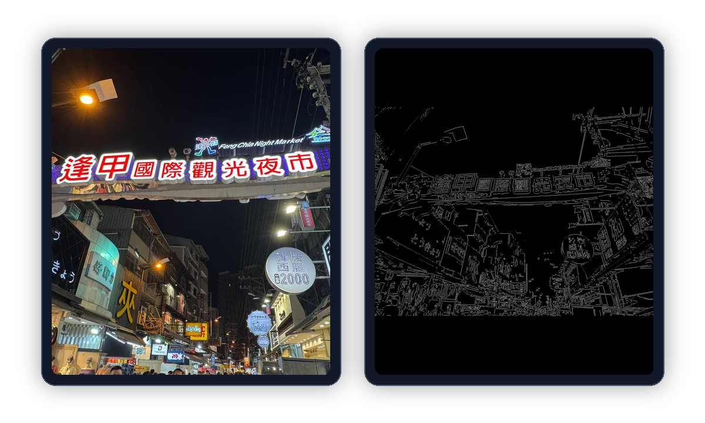
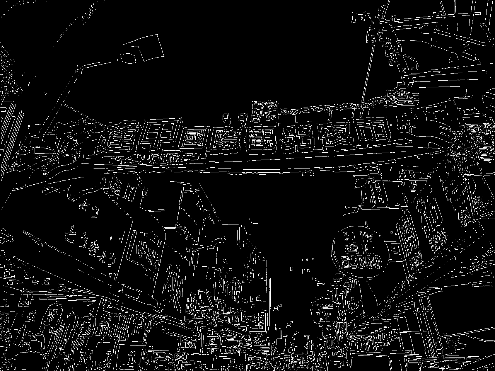

# Manual Canny Edge Detection

Coursework project for Image Processing.

This project implements the Canny edge detection pipeline manually without using `cv2.Canny`.

## Preview



## Coursework Note

Built as an academic project to practice implementing an edge detection algorithm step by step instead of relying on a built-in library function.

## Pipeline

- Convert input image to grayscale
- Apply Gaussian blur
- Compute Sobel gradients
- Calculate gradient magnitude and direction
- Quantize directions into 4 bins
- Apply non-maximum suppression
- Use double thresholding
- Link edges with connected components

## Tech Stack

- Python
- OpenCV
- NumPy

## Run

```bash
pip install -r requirements.txt
python manual_canny.py photo1.jpg --out_dir output
python manual_canny.py photo2.jpg --out_dir output
```

Sample final-edge outputs and threshold logs are included in `sample-output/`.

## Sample Output

| Input | Final edges |
| --- | --- |
| `photo1.jpg` |  |
| `photo2.jpg` |  |
